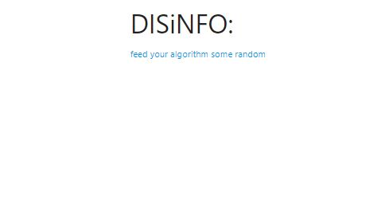
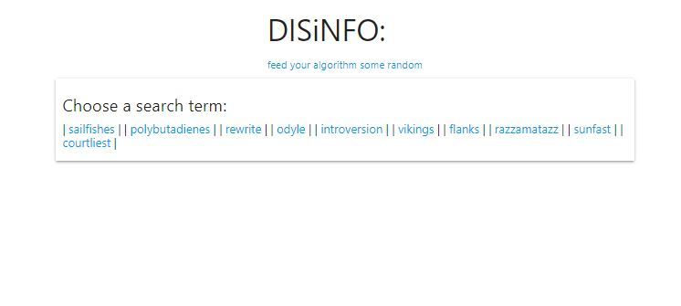
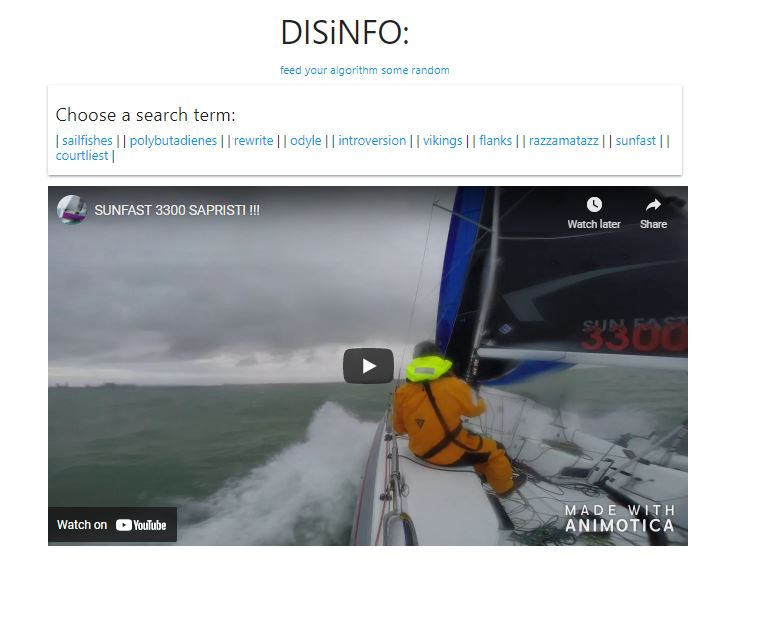

# DISiNFO

## Description:

A random video generator.

## Table of contents:

- [Installation](#installation)
- [Screenshots](#screenshots)
- [Demo](#demo)
- [Usage](#usage)
- [Contributing](#contributing)
- [Contact](#contact)
- [License](#license)

# Installation Instructions

Clone the repo and go nuts.

# Screenshots

Landing page

Random word generation

Youtube embed

# Demo

See the deployed app [here](https://queenmcsteve.github.io/disinfo/)

# Usage

Go nuts.

# Contributing

Hit me up on email.

# Contact

If you have any questions you can reach me via:

- Github: [queenmcsteve](https://github.com/queenmcsteve)
- Email: [queen.mcsteve.666@gmail.com](mailto:queen.mcsteve.666@gmail.com)

# License

[This project is licensed under the terms of the MIT license.](https://opensource.org/licenses/MIT)
